# UML 类与类之间的关系（内容来自 UML 精粹第三版标准对象建模语言简明指南）

## 依赖（Dependency）：是一种使用关系，即一个类 A 的实现需要用到另一个类 B，则称 A 依赖 B

```plain
    UML精粹：如果改动一个成分（供应方supplier）的定义可引起另一个成分（客户方client）的改动，则称在这两个成分之间存在一种依赖。依赖是单向的。
    代码表现：局部变量、形参、A调用B的静态方法
    UML图：带箭头的虚线，箭头指向B，即A依赖B
    PLANTUML代码：A..>B
```

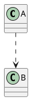

## 关联（Association）：是一种拥有关系，它使类 A 知道类 B 的属性和方法。可以是单向或双向的，自身关联。如老师有多名学生，学生也可以有多名老师;一个学生可以有多门功课，但是课程是抽象的东西，不能有学生（不强调整体与部分语义， has）

```plain
    代码表现：成员变量
    UML图：
        默认不带箭头的实现，互相关联；也可以使用双向箭头
        如果关联是单向的，使用箭头，源类指向目标类
    PLANTUML：
        老师--学生;
        老师<-->学生;
        人 --> 汽车
```

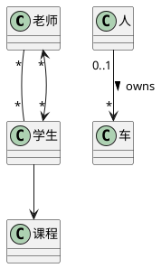

### 聚合(Aggregation)：整体与部分的关系，且部分可以离开整体而存在。如车和轮胎（特殊的关联关系，具有整体与部分语义， has）

```plain
    UML精粹：UML虽然包含了聚合，但几乎没有任何编码意义。只是语义区别
    代码表现：成员变量
    UML图：空心菱形实线，菱形指向整体
    PLANTUML：汽车o--轮胎；汽车 o--> 轮胎
```

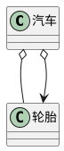

### 组合(Composition)：整体与部分关系，但部分不能离开整体而存在。如公司和部门。与聚合比，组合中，整体负责部分的对象的生命周期（特殊的关联关系，具有整体与部分语义，且部分与整体同生共死， contains）

```plain
    UML精粹：1、没有标明组合类的重数，基本上是0或者1；2、如果删除公司，保存的部门等信息也都会被删除（这2点也是和聚合、关联的重要区别，作者建议直接抛弃聚合，但GoF设计模式似乎没有关联，只有聚合和组合概念），具有生命周期的关联
    代码表现：成员变量
    UML图：实心菱形实线，菱形指向整体
    PLANTUML：公司*--部门
```

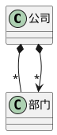

## 泛化（继承，Generalization）：是一种继承关系

```plain
    代码表现：继承关系,extends
    UML图：三角箭头实线，三角形指向基类
    PLANTML：Animal <|-- Tiger
```

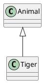

## 实现（Realization）：类与接口的关系，表示类实现了接口所有特征和行为

```plain
    UML精粹：抽象类和接口，这部分比较复杂，需要细度
    代码表现：关键字implements
    UML图：三角箭头虚线，三角形指向接口
    PLANTUML：IBrush <|.. PenBrush
```

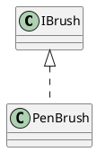

## 注文与注释：注文是图中的注释。注文可以单独放，也可以用一条虚线将它和其所注释的成分相连接

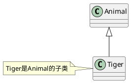

## 关联、聚合、组合：更多是语义上的区别，代码实现层次组合负责组合对象生命周期，关联和聚合无该操作关系

```plain
    关联：不强调整体与部分关系，例如老师和学生，学生和功课
    聚合和组合：强调整体与部分，是特殊的关联关系；聚合不负责聚合对象的构建和销毁；而组合则负责组合对象的构建和销毁
```

## plantuml 语法

- 类之间的关系：扩展(<|--)、组合(\*--)、聚合(o--)
- 关系上的标识：

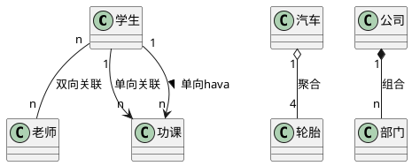

- 添加方法:

```js
/*
        - private
        # protected
        + public
        ~ package private
        {static} 静态
        {abstract} 抽象
     */
```

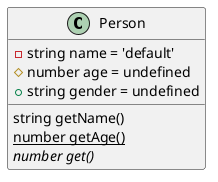

- 自定义分隔符:

```js
/*
        -- 细实线
        .. 单虚线
        == 双实线
        __ 默认分割线
        -- note -- note是注释
    */
```

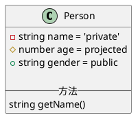

- 备注和模板

```js
/* 
        备注：note left of Object : detail
    */
```

- 抽象类：abstract class, interface, annotation enum

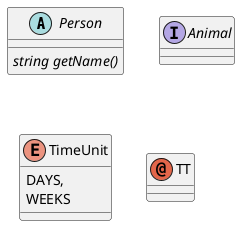

[plantuml class 指南](https://plantuml.com/zh/class-diagram)
