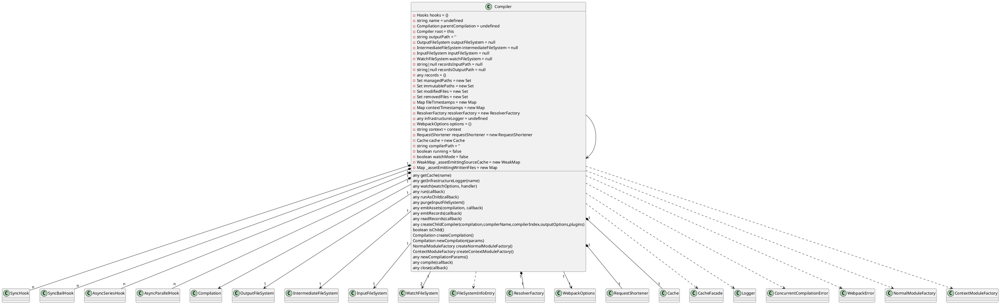

# 预备知识
* webapp使用版本：webpack-v4.26.9,tapable-1.1.0
* webpack版本：v5.0.0-beta.9
* 依赖Tapable版本：v2.0.0-beta.8
## `tapable 2.0.0-beta.11`

```plantuml
@startuml 2.0.0-beta.11
    class Hook {
        - any _args = args
        - string name = name
        - any[] taps = []
        - any[] interceptors = []
        - any _call = CALL_DELEGATE
        - any call = CALL_DELEGATE
        - any _callAsync = CALL_ASYNC_DELEGATE
        - any callAsync = CALL_ASYNC_DELEGATE
        - any _promise = PROMISE_DELEGATE
        - any promise = PROMISE_DELEGATE
        - any[] _x = undefined
        - any compile = this.compile
        - any tap = this.tap
        - any tapAsync = this.tapAsync
        - any tapPromise = this.tapPromise
        {abstract} any compile(options)
        any _createCall(type)
        any _tap(type, options, fn)
        any tap(options, fn)
        any tapAsync(options, fn)
        any tapPromise(options, fn)
        _runRegisterInterceptors(options)
        any withOptions(options)
        any isUsed()
        any intercept(interceptor)
        any _resetCompilation()
        any _insert(item)
    }
    Hook <|-- SyncHook 
    Hook <|-- SyncLoopHook 
    Hook <|-- SyncBailHook 
    Hook <|-- SyncWaterfallHook 
    Hook <|-- AsyncSeriesHook 
    Hook <|-- AsyncSeriesWaterfallHook
    Hook <|-- AsyncSeriesLoopHook 
    Hook <|-- AsyncSeriesBailHook 
    Hook <|-- AsyncParallelHook 
    Hook <|-- AsyncParallelBailHook
    class HookCodeFactory {
        - any config = config
        - any options = undefined
        - any _args = undefined
        any create(options)
        any setup(instance, options)
        any init(options)
        any deinit()
        any contentWithInterceptors(options)
        any header()
        any needContext()
        any callTap(tapIndex, options)
        any callTapSeries(options)
        any callTapsLooping(options)
        any callTapsParallel(options)
        any args(options)
        any getTapFn(idx)
        any getTap(idx)
        any getInterceptor(idx)
    }
    HookCodeFactory <|-- SyncHookCodeFactory
    HookCodeFactory <|-- SyncLoopHookCodeFactory 
    HookCodeFactory <|-- SyncBailHookCodeFactory 
    HookCodeFactory <|-- SyncWaterfallHookCodeFactory 
    HookCodeFactory <|-- AsyncSeriesHookCodeFactory 
    HookCodeFactory <|-- AsyncSeriesWaterfallHookCodeFactory
    HookCodeFactory <|-- AsyncSeriesLoopHookCodeFactory 
    HookCodeFactory <|-- AsyncSeriesBailHookCodeFactory 
    HookCodeFactory <|-- AsyncParallelHookCodeFactory 
    HoHookCodeFactoryok <|-- AsyncParallelBailHookCodeFactory
    class HookMap {
        - any _map = undefined
        - string name = name
        - any _factory = factory
        - any[] _interceptors = []
        any get(key)
        any for(key)
        any intercept(interceptor)
    }
    class MultiHook {
        - any hooks = hooks
        - string name = name
        any tap(options, fn)
        any tapAsync(options, fn)
        any tapPromise(options, fn)
        boolean isUsed()
        any intercept(interceptor)
        any withOptions(options)
    }

@enduml
```

## `webpackv5.0.0-beta.9`

```
--------------------------------------------------------------------------------------------------------------------
               class Dependency                 class MultiEntryDependency extends Dependency 
--------------------------------------------------------------------------------------------------------------------
    this.module = null                              this.dependencies = dependences
    this.weak = false                               this.name = name
    this.optional = false
    this.loc = undefined
--------------------------------------------------------------------------------------------------------------------
    getResourceIdentifier()
    getReference()
    getExports()
    getWarnings()
    getErrors()
    updateHash(hash)
    disconnect()
--------------------------------------------------------------------------------------------------------------------


--------------------------------------------------------------------------------------------------------------------
            class DependenciesBlock                             class Module extends DependenciesBlock
--------------------------------------------------------------------------------------------------------------------
    this.dependencies = []                                  this.type = type
    this.blocks = []                                        this.context = context
    this.variables = []                                     this.debugId = debugId++
                                                            this.hash = undefined
                                                            this.renderedHash = undefined
                                                            this.resolveOptions = EMPTY_RESOLVE_OPTIONS
                                                            this.factoryMeta = {}
                                                            this.warnings = []
                                                            this.errors = []
                                                            this.buildMeta = undefined
                                                            this.buildInfo = undefined
                                                            this.reasons = []
                                                            this._chunks = new SortableSet(undefined, sortById)
                                                            this.id = null
                                                            this.index = null
                                                            this.index2 = null
                                                            this.depth = null
                                                            this.issuer = null
                                                            this.profile = undefined
                                                            this.prefetched = false
                                                            this.built = false
                                                            this.used = null
                                                            this.usedExports = null
                                                            this.optimizationBailout = []
                                                            this._rewriteChunkInReasons = undefined
                                                            this.useSourceMap = false
                                                            this._source = null
--------------------------------------------------------------------------------------------------------------------
    addBlock(block)                                         setChunks(chunks)
    addVariable(name, expression, dependencies)             addChunk(chunk)
    addDependency(denpendency)                              removeChunk(chunk)
    removeDependency(dependency)                            isInChunk(chunk)
    updateHash(hash)                                        updateHash(hash)
    disconnect()                                            disconnect() 
    unseal()                                                unseal()
    hasDependencies(filter)                                 getChunks()
    sortItems()                                             sortItems(sortChunks)
                                                            hasEqualsChunks(otherModule)
                                                            addReason(module, dependency, explanation)
                                                            removeReason(module, dependency)
                                                            hasReasonForChunk(chunk)
                                                            hasReasons()
                                                            rewriteChunkInReasons(oldChunk, newChunks)
                                                            _doRewriteChunkInReasons(oldChunk, newChunks)
                                                            isUsed(exportName)
                                                            isProvided(exportName)
                                                            toString()
                                                            needRebuild(fileTimestamps, contextTimestamps)
                                                            isEntryModule()
                                                            getNumberOfChunks()
                                                            unbuild()
--------------------------------------------------------------------------------------------------------------------


--------------------------------------------------------------------------------------------------------------------
            class MultiModule extends Module                        class MultiModuleFactory extends Tapable 
--------------------------------------------------------------------------------------------------------------------
    this.dependencies = dependencies                                    this.hooks = {}
    this.name = name
    this._identifies = XXX
--------------------------------------------------------------------------------------------------------------------
    identifier()                                                        create(data, callback)
    readableIdentifier(requestShortener)
    build(options, compilation, resolver, fs, callback)
    needRebuild()
    size()
    updateHash(hash)
    source(dependencyTemplates, runtimeTemplate)
--------------------------------------------------------------------------------------------------------------------


--------------------------------------------------------------------------------------------------------------------
                RuntimeTemplate                                 Semaphore
--------------------------------------------------------------------------------------------------------------------
    this.outputOptions = outputOptions                      this.available = available
    this.requestShortener = requestShortener                this.waters = []
                                                            this._continue = this._continue.bind(this)
--------------------------------------------------------------------------------------------------------------------
                                                            acquire(callback)
                                                            release()
                                                            _continue()
--------------------------------------------------------------------------------------------------------------------


--------------------------------------------------------------------------------------------------------------------
             class ModuleTemplate extends Tapable   
--------------------------------------------------------------------------------------------------------------------
    this.runtimeTemplate = runtimeTemplate
    this.type = type
    this.hooks = {
        content: new SyncWaterfallHook(["source", "module", "options", "dependencyTemplates"]),
		module: new SyncWaterfallHook(["source", "module", "options", "dependencyTemplates"]),
		render: new SyncWaterfallHook(["source", "module", "options", "dependencyTemplates"]),
		package: new SyncWaterfallHook(["source", "module", "options", "dependencyTemplates"]),
		hash: new SyncHook(["hash"])
    }
--------------------------------------------------------------------------------------------------------------------


--------------------------------------------------------------------------------------------------------------------
                class HotUpdateChunkTemplate extends Tapable
--------------------------------------------------------------------------------------------------------------------
    this.outputOptions = outputOptions
    this.hooks = {
        modules: new SyncWaterfallHook(['source', 'modules', 'removedModules', 'moduleTemplates']),
        render: new SyncWaterfallHook(['source', 'modules', 'removedModules', 'hash', 'id', 'moduleTemplate', 'dependencyTemplates']),
        hash: new SyncHook(['hash'])
    }
--------------------------------------------------------------------------------------------------------------------


--------------------------------------------------------------------------------------------------------------------
                class ChunkTemplate extends Tapable
--------------------------------------------------------------------------------------------------------------------
    this.outputOptions = outputOptions
    this.hooks = {
        renderManifest: new SyncWaterfallHook(['result', 'options']),
        modules: new SyncWaterfallHook(['source', 'chunk', 'moduleTemplate', 'dependencyTemplates']),
        render: new SyncWaterfallHook(['source', 'chunk', 'moduleTemplate', 'dependencyTemplates']),
        renderWithEntry: new SyncWaterfallHook(['source', 'chunk']),
        hash: new SyncHook(['hash']),
        hashForChunk: new SyncHook(['hash', 'chunk']),
    }
--------------------------------------------------------------------------------------------------------------------


--------------------------------------------------------------------------------------------------------------------
                class MainTemplate extends Tapable
--------------------------------------------------------------------------------------------------------------------
    this.outputOptions = outputOptions
    this.requireFn = '__webpack_require__'
    this.hooks = {
        renderManifest: new SyncWaterfallHook(['result', 'options']),
        modules: new SyncWaterfallHook(['modules', 'chunk', 'hash', 'moduleTemplate', 'dependencyTemplates']),
        moduleObj: new SyncWaterfallHook(['source', 'chunk', 'hash', 'moduleIdExpression']),
        requireEnsure: new SyncWaterfallHook(['source', 'chunk', 'hash', 'chunkIdExpression']),
        bootstrap: new SyncWaterfallHook(['source', 'chunk', 'hash', 'moduleTemplate', 'dependencyTemplates']),
        localVars: new SyncWaterfallHook(['source', 'chunk', 'hash']),
        require: new SyncWaterfallHook(['source', 'chunk', 'hash']),
        requireExtensions: new SyncWaterfallHook(['source', 'chunk', 'hash']),
        beforeStartup: new SyncWaterfallHook(['source', 'chunk', 'hash']),
        startup: new SyncWaterfallHook(['source', 'chunk', 'hash']),
        render: new SyncWaterfallHook(['source', 'chunk', 'hash', 'moduleTemplate', dependencyTemplates]),
        renderWithEntry: new SyncWaterfallHook(['source', 'chunk', 'hash']),
        moduleRequire: new SyncWaterfallHook(['source', 'chunk', 'hash', 'moduleIdExpression']),
        addModule: new SyncWaterfallHook(['source', 'chunk', 'hash', 'moduleIdExpression', 'moduleExpression']),
        currentHash: new SyncWaterfallHook(['source', 'requestedLength']),
        assetPath: new SyncWaterfallHook(['path', 'options']),
        hash: new SyncHook(['hash']),
        globalHashPaths: new SyncWaterfallHook(['paths']),
        globalHash: new SyncBailHook(['chunk', 'paths']),
        hotBootstrap: new SyncBailHook(['chunk', 'paths'])
    }
--------------------------------------------------------------------------------------------------------------------
--------------------------------------------------------------------------------------------------------------------


--------------------------------------------------------------------------------------------------------------------
        ResolverFactory extends Tapable
--------------------------------------------------------------------------------------------------------------------
    this.hooks = {
        resolverOptions: new HookMap(()=>new SyncWaterfallHook(['resolverOptions'])),
        resolver: new HookMap(() => new SyncHook(['resolver', 'resolverOptions']))
    }
    this.cache1 = new WeakMap()
    this.cache2 = new Map()
--------------------------------------------------------------------------------------------------------------------


--------------------------------------------------------------------------------------------------------------------
    Compiler                                    Compilation
--------------------------------------------------------------------------------------------------------------------
    this.parentCompilation = undefined				            this.compiler = compiler
	this.inputFileSystem = null(NodeEnvironmentPlugin初始化)	 this.inputFileSystem = compiler.inputFileSystem
	this.resolverFactory = new ResolverFactory()			    this.resolverFactory = compiler.resolverFactory
	this.options = ({})						                    this.options = compiler.options
	this.requestShortener = new RequestShortener(context)		this.requestShortener = compiler.requestShortener
    this.hooks = {}							                    this.hooks = {}

    this.name = undefined(WebpackOptionsAooly初始化)			 this.name = undefined(新建，用compiler属性赋值)
    this.fileTimestamps = new Map()                             this.fileTimestamps = new Map()(新建，用compiler属性赋值)
    this.contextTimestamps = new Map()                          this.contextTimestamps=new Map()(新建，用compiler属性赋值)
    this.records = {}                                           this.records = {}(新建，用compiler属性赋值)

--------------------------------------------------------------------------------------------------------------------
    this.outputPath = ''(WebpackOptionsAooly初始化)				 this.outputOptions = options && options.output/* options = compiler.options */
	this.outputFileSystem = null(NodeEnvironmentPlugin初始化)	 this.bail = options && options.bail
	this.recordsInputPath = null(WebpackOptionsAooly初始化)		 this.profile = options && options.profile			
	this.recordsOutputPath = null(WebpackOptionsAooly初始化)	 this.performance = options && options.performance
	this.dependencies = options.dependencies(WebpackOptionsAooly初始化)
    this.context = context	                                    this.mainTemplate = new MainTemplate(this.outputOptions)
	this.removedFiles = new Set()					            this.chunkTemplate = new ChunkTemplate(this.outputOptions)
	this.running = false                        this.hotUpdateChunkTemplate=new HotUpdateChunkTemplate(this.outputOptions)	
	this.watchMode = false              this.runtimeTemplate=new RuntimeTemplate(this.outputOptions, this.requestShotener)
	this.watchMode = false                                      this.semaphore = new Semaphore(options.parallelism || 100)
							                                    this.entries = []
							                                    this._prepareEntrypoints = []
	this._assetEmittingSourceCache = new WeakMap()			    this.entrypoints = new Map()
	this._assetRmittingWrittenFiles = new Map()			        this.chunks = []
	this.resolvers = {						                    this.chunkGroups = []
		normal: {						                        this.namedChunkGroups = new Map()
			plugins: function,				                    this.namedChunks = new Map()
			apply: function					                    this.modules = []
		},							                            this._modules = new Map()
		loader: {						                        this.cache = null
			plugins: function,                                  this.emittedAssets = new Set()
			apply: function					                    this.additionalChunkAssets = []
		},							                            this.assets = {}
		context: {						                        this.errors = []
			plugins: function,				                    this.wardings = []
			apply: function					                    this.children = []
		}							                            this.dependencyFactories = new Map()
									                            this.dependencyTemplates = new Map()
	}								                            this.childrenCounters = {}
									                            this.usedChunkIds = null
									                            this.usedModuleIds = null
									                    this.compilationDependencies = undefined(新建，用params属性赋值)
									                            this._buildingModules = new Map() 
									                            this.moduleTemplates = {
										                            javascript: new ModuleTemplate(this.runtimeTemplate, 'javascript'),
										                            webassembly: new ModuleTemplate(this.runtimeTemplate, 'webassembly')
									                            }
--------------------------------------------------------------------------------------------------------------------


--------------------------------------------------------------------------------------------------------------------
        NormalModuleFactory                                                             ContextModuleFactory
--------------------------------------------------------------------------------------------------------------------
this.resolverFactory = resolverFactory                                      this.resolverFactory = resolverFactory
this.ruleSet = new RuleSet(options.defaultRules.concat(options.rules))      this.hooks = {
this.cachePredicate = XXX                                           beforeResolve: new AsyncSeriesWaterfallHook(["data"]),
this.context = context || ''                                        afterResolve: new AsyncSeriesWaterfallHook(['data']),
this.parserCache = Object.create(null)                              contextModuleFiles: new SyncWaterfallHook(['files']),
this.generatorCache = Object.create(null)                           alternatives:new AsyncSeriesWaterfallHook(['modules'])
this.hooks = {                                                              }
    resolver: new SyncWaterfallHook(["resolver"]),
	factory: new SyncWaterfallHook(["factory"]),
	beforeResolve: new AsyncSeriesWaterfallHook(["data"]),
	afterResolve: new AsyncSeriesWaterfallHook(["data"]),
	createModule: new SyncBailHook(["data"]),
	module: new SyncWaterfallHook(["module", "data"]),
	createParser: new HookMap(() => new SyncBailHook(["parserOptions"])),
	parser: new HookMap(() => new SyncHook(["parser", "parserOptions"])),
	createGenerator: new HookMap(
		() => new SyncBailHook(["generatorOptions"])
	),
	generator: new HookMap(
		() => new SyncHook(["generator", "generatorOptions"])
	)
}
--------------------------------------------------------------------------------------------------------------------
    create(data, callback)                                                      create(data, callback)
    resolveRequestArray(contextInfo, context, array, resolver, callback)        resolveDependencies(fs, options, callback)
    getParser(type, parserOptions)                                              
    createParser(type, parserOptions = {})
    getGenerator(type, generatorOptions)
    createGenerator(type, generatorOptions = {})
    getResolver(type, resolverOptions)
--------------------------------------------------------------------------------------------------------------------
```
# webpack执行流程
## 1、校验options
```
    三方库：ajv，ajv-keywords
    ajv：JSON schema验证工具
```
## 2、生成Compiler实例
```
    数组options：2-1、使用MultiCompiler生成compiler
    单对象：2-2、使用Compiler
```
## 2-1、流程暂无
## 2-2、Compiler流程
## 2-2-1、合并options和内置defaultOptions
```
    defaultOptions中，会设定options的默认值，例如context = process.cwd()
```
## 2-2-2、compiler = new Compiler(context)
```
    实例化Copmiler
    compiler.options = options
```
## 2-2-3、执行NodeEnvironmentPlugin插件
```
    执行NodeEnvironment，注册监听器，并初始化compiler部分属性
        compiler.inputFileSystem = new CachedInputFileSystem(new NodeJsInputFileSystem(), 60000)
        compiler.outputFileSystem = new NodeOutputFileSystem()
        compiler.watchFileSystem = new NodeWatchFileSystem(compiler.inputFileSystem)
```
## 2-2-4、执行options.plugins插件，注册监听器
```
```
## 2-2-5、广播environment(SyncHook，call)事件
```
    当前事件暂无监听器
```
## 2-2-6、广播afterEnvironment(SyncHook，call)事件
```
    当前事件暂无监听器
```
## 2-2-7、实例化WebpackOptionsApply：webpackOptionsApply
```js
    /* constructor：无 */ 
```
## 2-2-8、执行webpackOptionsApply.process(options, compiler)
```js
    /* compiler部分属性赋值 */
    compiler.outputPath = options.output.path
    compiler.recordsInputPath = options.recordsInputPath || options.recordsPath
    compiler.recordsOutputPath = options.recordsOutputPath || options.recordsPath
    compiler.name = options.name
    compiler.dependencies = options.dependencies

```
## 2-2-8-1、实例化部分插件，并执行apply
```
    1、JsonpTemplatePlugin:
    2、FetchCompileWasmTemplatePlugin: 
    3、FunctionModulePlugin:
    4、NodeSourcePlugin: 
    5、LoaderTargetPlugin:
        apply：
            为compilation注册监听器
    6、WebWorkerTemplatePlugin:
        apply：
            为thisCompilation注册监听器
    7、NodeTemplatePlugin:
        apply: 
            为thisCompilation注册监听器
    8、ReadFileCompileWasmTemplatePlugin:
        apply: 
            为thisCompilation注册监听器
    9、NodeTargetPlugin:
        apply: 
            实例化ExternalsPlugin:,执行apply: 
    10、ExternalsPlugin:
        apply: 
            为compile注册监听器
    11、LibraryTemplatePlugin:
        apply: 为thisCompilation注册监听器
    12、EvalSourceMapDevToolPlugin:
        apply:
            为compilation注册监听器
    13、SourceMapDevToolPlugin:
        apply: 
            为compilation注册监听器
    14、EvalDevToolModulePlugin:
        apply:
            为compilation注册监听器
    15、JavascriptModulesPlugin:
        apply:
            为compilation注册监听器
    16、JsonModulesPlugin:
        apply:
            为compilation注册监听器
    17、WebAssemblyModulesPlugin:
        apply:
            为compilation注册监听器
    18、EntryOptionPlugin:
        apply:
            为entryOption注册监听器
```
## 2-2-8-2、广播entryOption（SyncBailHook，call）事件
```
    执行监听器：vConsolePlugin、EntryOptionPlugin
    EntryOptionPlugin:
        1、entry是字符串，执行SingleEntryPlugin
            apply:
                1、为compilation注册监听器
                2、为make注册监听器
        2、entry时数组，执行MultiEntryPlugin
            apply:
                1、为compilation注册监听器
                2、为make注册监听器
        3、entry时函数，执行DynamicEntryPlugin
            apply:
                1、为compilation注册监听器
                2、为make注册监听器
```
## 2-2-8-3、实例化部分插件，并执行apply
```
    19、CompatibilityPlugin:
        apply:
            为compilation注册监听器
    20、HarmonyModulesPlugin:
        apply:
            为compilation注册监听器
    21、AMDPlugin:
        apply:
            为compilation注册监听器
    22、CommonJsPlugin:
        apply:
            为compilation注册监听器
    23、LoaderPlugin:
        apply:
            1、为compilation注册监听器
            2、为compilation注册监听器
    24、NodeStuffPlugin:
        apply:
            1、为compilation注册监听器
    25、RequireJsStuffPlugin:
        apply:
            1、为compilation注册监听器
    26、APIPlugin:
        apply:
            1、为compilation注册监听器
    27、ConstPlugin:
        apply:
            1、为compilation注册监听器
    28、UseStrictPlugin:
        apply:
            1、为compilation注册监听器
    29、RequireIncludePlugin:
        apply:
            1、为compilation注册监听器
    30、RequireEnsurePlugin:
        apply:
            1、为compilation注册监听器
    31、RequireContextPlugin:
        apply:
            1、为compilation注册监听器
    32、ImportPlugin:
        apply:
            1、为compilation注册监听器
    33、SystemPlugin:
        apply:
            1、为compilation注册监听器
    34、WarnNoModeSetPlugin:
        apply:
            1、为thisCompilation注册监听器
    35、EnsureChunkConditionsPlugin:
        apply:
            1、为compilation注册监听器
    36、RemoveParentModulesPlugin:
        apply:
            1、为compilation注册监听器
    37、RemoveEmptyChunksPlugin:
        apply:
            1、为compilation注册监听器
    38、MergeDuplicateChunksPlugin:
        apply:
            1、为compilation注册监听器
    39、FlagIncludedChunksPlugin:
        apply:
            1、为compilation注册监听器
    40、SideEffectsFlagPlugin:
        apply:
            1、为compilation注册监听器
            2、为normalModuleFactory注册监听器
    41、FlagDependencyExportsPlugin:
        apply:
            1、为compilation注册监听器
    42、FlagDependencyUsagePlugin:
        apply:
            1、为compilation注册监听器
    43、ModuleConcatenationPlugin:
        apply:
            1、为compilation注册监听器
    44、SplitChunksPlugin:
        apply:
            1、为thisCompilation注册监听器
    45、RuntimeChunkPlugin:
        apply:
            1、为thisCompilation注册监听器
    46、NoEmitOnErrorsPlugin:
        apply:
            1、为compilation注册监听器
            2、为shouldEmit注册监听器
    47、WasmFinalizeExportsPlugin:
        apply:
            1、为compilation注册监听器
    48、NamedModulesPlugin:
        apply:
            1、为compilation注册监听器
    49、HashedModuleIdsPlugin:
        apply:
            1、为compilation注册监听器
    50、OccurrenceModuleOrderPlugin:
        apply:
            1、为compilation注册监听器
    51、NaturalChunkOrderPlugin:
        apply:
            1、为compilation注册监听器
    52、OccurrenceChunkOrderPlugin:
        apply:
            1、为compilation注册监听器
    53、NamedChunksPlugin:
        apply:
            1、为compilation注册监听器
    54、DefinePlugin:
        apply:
            1、为compilation注册监听器
    55、SizeLimitsPlugin:
        apply:
            1、为afterEmit注册监听器
    56、TemplatedPathPlugin:
        apply:
            1、为compilation注册监听器
    57、RecordIdsPlugin:
        apply:
            1、为compilation注册监听器
    58、WarnCaseSensitiveModulesPlugin:
        apply:
            1、为compilation注册监听器
    59、CachePlugin:
        apply:
            1、为watchRun注册监听器
            2、为run注册监听器
            3、为afterCompile注册监听器
```
## 2-2-8-4、广播afterPlugins(SyncHook, call)事件
```
    当前事件暂无监听器
```
## 2-2-8-5、为compiler.resolverFactory执行插件，注册相关监听器
```
    /* HookMap的for：查找指定hook，如果存在则返回；否者，新建hook，并返回。非循环*/
    1、compiler.resolverFactory.hooks.resolverOptions.for('normal')：为resolverOptions.normal注册监听器WebpackOptionsApply
    2、compiler.resolverFactory.hooks.resolverOptions.for('context')：为resolverOptions.context注册监听器WebpackOptionsApply
    3、compiler.resolverFactory.hooks.resolverOptions.for('loader')：为resolverOptions.loader注册监听器WebpackOptionsApply
```
## 2-2-8-6、广播afterResolvers(SyncHook, call)事件
```
    执行监听器：NodeSourcePlugin、AMDPlugin

    NodeSourcePlugin：
        1、引入三方库：node-libs-browser，Exports a hash [object] of absolute paths to each lib, keyed by lib names
        2、为compiler.resolverFactory.hooks.resolver.for('normal'): 为resolver.normal注册监听器NodeSourcePlugin
    AMDPlugin：
        1、compiler.resolverFactory.hooks.resolver.for('normal'): 为resolver.normal注册监听器AMDPlugin
```
## 3、执行compiler.run
```
    this.running = true
```
## 3-1、广播beforeRun(AsyncSeriesHook, callAsync)事件
```
    三方库：enhanced-resolve，Offers an async require.resolve function. It's highly configurable.
    监听器：NodeEnvironmentPlugin
    NodeEnvironmentPlugin：
        清空缓存（细节待查）  
```
## 3-2、广播run(AsyncSeriesHook, callAsync)事件
```
    监听器：fork-ts-checker-webpack-plugin, ManifestPlugin
        fork-ts-checker-webpack-plugin(options插件)：
        ManifestPlugin(options插件)：
```
## 3-3、执行this.readRecords
```
    compiler.records = {}
```
## 3-4、执行this.compile
```js
    // 1、生成compiltion参数
    const params = {
        normalModuleFactory,
        contextModuleFactory,
        compilationDependencies: new Set()
    }
```
## 3-4-1、新建一个NormalModuleFactory实例
```
    1、normalModuleFactory = new NormalModuleFactory(this.options.context,this.resolverFactory, this.options.module || {})
    2、注册监听器
        this.hooks.factory.tap('NormalModuleFactory')，为factory注册监听器NormalModuleFactory
        this.hooks.resolver.tap('NormalModuleFactory')，为resolver注册监听器NormalModuleFactory
```
## 3-4-2、广播normalModuleFactory事件，并返回normalModuleFactory
```
    监听器：ModuleNotFoundPlugin, IgnorePlugin, SideEffectsFlagPlugin
    ModuleNotFoundPlugin(options插件):
	IgnorePlugin(options插件):
	SideEffectsFlagPlugin:
		1、nmf.hooks.module.tap：为module注册监听器SideEffectsFlagPlugin
        2、nmf.hooks.module.tap：为module注册监听器SideEffectsFlagPlugin
```
## 3-4-3、新建一个ContextModuleFactory实例
```
    1、contextModuleFactory = new ContextModuleFactory(this.resolverFactory)
```
## 3-4-4、广播contextModuleFactory事件，并返回contextModuleFactory
```
    监听器：IgnorePlugin
    IgnorePlugin(options插件):
```
## 3-4-5、生成参数后，广播beforeCompile事件
```
    监听器：无
```
## 3-4-6、广播compile事件
```
    监听器：fork-ts-checker-webpack-plugin, smp
    fork-ts-checker-webpack-plugin(options插件):
	smp(speed-measure-webpack-plugin, options插件):
```
## 3-4-7、新建Compilation实例
```
    新建compilation = new Compilation(compiler)
    <!-- compilation.mainTemplate: MainTemplate构建过程 -->
    MainTemplate constructor：
        1、为startup注册监听器MainTemplate
        2、为render注册监听器MainTemplate
        3、为localVars注册监听器MainTemplate
        4、为require注册监听器MainTemplate
        5、为moduleObj注册监听器MainTemplate
        6、为requireExtensions注册监听器MainTemplate

    compilation.fileTimestamps = this.fileTimestamps;// this就是compiler
    compilation.contextTimestamps = this.contextTimestamps;
	compilation.name = this.name;
	compilation.records = this.records;

    compilation.compilationDependencies = params.compilationDependencies
```
## 3-4-8、广播thisCompilation事件
```
    监听器：HtmlWebpackPlugin,JsonpTemplatePlugin,FetchCompileWasmTemplatePlugin,SplitChunksPlugin,RuntimeChunkPlugin
    HtmlWebpackPlugin(options插件):
    speed-measure-webpack-plugin(options插件):
	JsonpTemplatePlugin:
		1、以compilation.mainTemplate为参数执行JsonpMainTemplatePlugin插件，
            1-1：为mainTemplate.hooks.localVars注册监听器JsonpMainTemplatePlugin
            1-2：为mainTemplate.hooks.jsonScript注册监听器JsonpMainTemplatePlugin
            1-3：为mainTemplate.hooks.linkPreload注册监听器JsonpMainTemplatePlugin
            1-4：为mainTemplate.hooks.linkPrefetch注册监听器JsonpMainTemplatePlugin
            1-5：为mainTemplate.hooks.requireEnsure注册监听器JsonpMainTemplatePlugin
            1-5：为mainTemplate.hooks.requireEnsure注册监听器JsonpMainTemplatePlugin preload
            1-6：为mainTemplate.hooks.requireExtensions注册监听器JsonpMainTemplatePlugin
            1-7：为mainTemplate.hooks.bootstrap注册监听器JsonpMainTemplatePlugin
            1-8：为mainTemplate.hooks.beforeStartup注册监听器JsonpMainTemplatePlugin
            1-9：为mainTemplate.hooks.beforeStartup注册监听器JsonpMainTemplatePlugin
            1-10：为mainTemplate.hooks.startup注册监听器JsonpMainTemplatePlugin
            1-11：为mainTemplate.hooks.hotBootstrap注册监听器JsonpMainTemplatePlugin
            1-12：为mainTemplate.hooks.hash注册监听器JsonpMainTemplatePlugin

		2、以compilation.chunkTemplate为参数执行JsonpChunkTemplatePlugin插件
            2-1：为chunkTemplate.hooks.render注册监听器JsonpChunkTemplatePlugin
            2-2：为chunkTemplate.hooks.hash注册监听器JsonpChunkTemplatePlugin
            2-3：为chunkTemplate.hooks.hashForChunk注册监听器JsonpChunkTemplatePlugin

		3、以compilation.hotUpdateChunkTemplate为参数执行JsonpHotUpdateChunkTemplatePlugin插件
            3-1：为hotUpdateChunkTemplate.hooks.render注册监听器JsonpHotUpdateChunkTemplatePlugin
            3-2：为hotUpdateChunkTemplate.hooks.hash注册监听器JsonpHotUpdateChunkTemplatePlugin

	FetchCompileWasmTemplatePlugin:
		1、以compilation.mainTemplate为参数，执行WasmMainTemplatePlugin插件
            1-1：为mainTemplate.hooks.localVars注册监听器WasmMainTemplatePlugin
            1-1：为mainTemplate.hooks.requireEnsure注册监听器WasmMainTemplatePlugin
            1-1：为mainTemplate.hooks.requireExtensions注册监听器WasmMainTemplatePlugin
            1-1：为mainTemplate.hooks.hash注册监听器WasmMainTemplatePlugin

	SplitChunksPlugin:
		1、为compilation.hooks.unseal事件注册监听器SplitChunksPlugin
		2、为compilation.hooks.optimizeChunksAdvanced事件注册监听器SplitChunksPlugin

	RuntimeChunkPlugin:
		1、为compilation.hooks.optimizeChunksAdvanced事件注册监听器RuntimeChunkPlugin
```
## 3-4-9、广播compilation事件
```
    监听器：["InlineChunkHtmlPlugin", "InterpolateHtmlPlugin", "DefinePlugin", "smp", "FunctionModulePlugin", "NodeSourcePlugin", "LoaderTargetPlugin", "SourceMapDevToolPlugin", "JavascriptModulesPlugin", "JsonModulesPlugin", "WebAssemblyModulesPlugin", "MultiEntryPlugin", "CompatibilityPlugin", "HarmonyModulesPlugin", "AMDPlugin", "CommonJsPlugin", "LoaderPlugin", "LoaderPlugin", "NodeStuffPlugin", "RequireJsStuffPlugin", "APIPlugin", "ConstPlugin", "UseStrictPlugin", "RequireIncludePlugin", "RequireEnsurePlugin", "RequireContextPlugin", "ImportPlugin", "SystemPlugin", "EnsureChunkConditionsPlugin", "RemoveParentModulesPlugin", "RemoveEmptyChunksPlugin", "MergeDuplicateChunksPlugin", "FlagIncludedChunksPlugin", "SideEffectsFlagPlugin", "FlagDependencyExportsPlugin", "FlagDependencyUsagePlugin", "ModuleConcatenationPlugin", "NoEmitOnErrorsPlugin", "WasmFinalizeExportsPlugin", "OccurrenceOrderModuleIdsPlugin", "OccurrenceOrderChunkIdsPlugin", "DefinePlugin", "TerserPlugin", "OptimizeCssAssetsWebpackPlugin", "TemplatedPathPlugin", "RecordIdsPlugin", "WarnCaseSensitiveModulesPlugin", "ManifestPlugin"]

    InlineChunkHtmlPlugin(options插件)：
    InterpolateHtmlPlugin(options插件)：
    DefinePlugin(options插件)：
    smp(options插件)：
    FunctionModulePlugin：
        1、以compilation.moduleTemplate.javascript为参数执行FunctionModuleTemplatePlugin的apply
            apply：
                1-1：为moduleTemplate.hooks.render注册监听器FunctionModuleTemplatePlugin
                1-2：为moduleTemplate.hooks.package注册监听器FunctionModuleTemplatePlugin
                1-3：为moduleTemplate.hooks.hash注册监听器FunctionModuleTemplatePlugin
    NodeSourcePlugin：
        1、为normalModuleFactory.hooks.parser.for('javascript/auto')注册监听器NodeSourcePlugin
        2、为normalModuleFactory.hooks.parser.for('javascript/dynamic')注册监听器NodeSourcePlugin
    LoaderTargetPlugin：
        1、为compilation.hooks.normalModuleLoader注册监听器LoaderTargetPlugin
    SourceMapDevToolPlugin：
        1、执行SourceMapDevToolModuleOptionsPlugin
            apply:
                1-1：为compilation.hooks.buildModule注册监听器SourceMapDevToolModuleOptionsPlugin
        2、为compilation.hooks.afterOptimizeChunkAssets注册监听器SourceMapDevToolPlugin
    JavascriptModulesPlugin：
        1、为normalModuleFactory.hooks.createParser.for("javascript/auto")注册监听器JavascriptModulesPlugin
        2、为normalModuleFactory.hooks.createParser.for("javascript/dynamic")注册监听器JavascriptModulesPlugin
        3、为normalModuleFactory.hooks.createParser.for("javascript/esm")注册监听器JavascriptModulesPlugin
        4、为normalModuleFactory.hooks.createGenerator.for("javascript/auto")注册监听器JavascriptModulesPlugin
        5、为normalModuleFactory.hooks.createGenerator.for("javascript/dynamic")注册监听器JavascriptModulesPlugin
        6、为normalModuleFactory.hooks.createGenerator.for("javascript/esm")注册监听器JavascriptModulesPlugin
        7、为mainTemplate.hooks.renderManifest注册监听器JavascriptModulesPlugin
        8、为mainTemplate.hooks.modules注册监听器JavascriptModulesPlugin
        9、为chunkTemplate.hooks.renderManifest注册监听器JavascriptModulesPlugin
        10、为compilation.hooks.contentHash注册监听器JavascriptModulesPlugin
    JsonModulesPlugin：
        1、为normalModuleFactory.hooks.createParser.for("json")注册监听器JsonModulesPlugin
        2、为normalModuleFactory.hooks.createGenerator.for("json")注册监听器JsonModulesPlugin
    WebAssemblyModulesPlugin：
        1、为compilation.dependencyFactories增加依赖
            1-1：compilation.dependencyFactories.set(WebAssemblyImportDependency, normalModuleFactory)
			1-2：compilation.dependencyFactories.set(WebAssemblyExportImportedDependency, normalModuleFactory)
        2、为normalModuleFactory.hooks.createParser.for("webassembly/experimental")注册监听器WebAssemblyModulesPlugin
        3、为normalModuleFactory.hooks.createGenerator.for("webassembly/experimental")注册监听器WebAssemblyModulesPlugin
        4、为chunkTemplate.hooks.renderManifest注册监听器WebAssemblyModulesPlugin
        5、为compilation.hooks.afterChunk注册监听器WebAssemblyModulesPlugin
```
## 3-4-10、广播make事件
```
```
