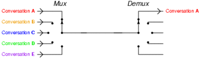

# 高并发服务器IO模型
[资料0](https://www.jianshu.com/p/2326dbec0915)

[资料1](https://segmentfault.com/a/1190000007614502)

[资料2](https://www.jianshu.com/p/0765d75f7c1b)

[这个最好2](https://www.zhihu.com/question/32163005/answer/55772739)
[这个最好3](https://www.zhihu.com/question/22062795)

## 什么是IO？
```
    IO (Input/Output，输入/输出)即数据的读取（接收）或写入（发送）操作
    通常用户进程中的一个完整 IO 分为两阶段：用户进程空间<-->内核空间、内核空间<-->设备空间（磁盘、网络等）
    有内存 IO、网络 IO 和磁盘 IO 三种，通常我们说的 IO 指的是后两者。
```
## 同步和异步：重点在消息通知的方式上，也就是调用结果通知的方式
```
    同步：当一个同步调用发出去之后，调用者要一直等待调用结果的通知后，才能进行后续的执行(必须等待IO操作完成，控制权才能返还给用户进程)
    异步：当一个异步调用发出去之后，调用者不能立即得到调用结果的返回(无需等待IO操作完成，控制权便返还给用户进程)
    异步调用要想获得结果一般有两种方式：
        主动轮询异步调用的结果
        被调用方通过回调callback来通知调用方调用结果
```
## 高并发网络IO模型
* `纯多进程模型（纯多线程模型）：`多进（线）程+进程（线程）池模型指的是每个进程（线程)处理一个IO数据流
```
    主进程（线程）监听客户端连接请求，每进来一个客户端就fork出来一个进程(线程)进行处理
```
* `IO多路复用模型（I/O multiplexing）+ 多线程：`指的是同一个进程可以处理多个IO数据流，并使用多线程（线程池）进行通信

multiplexing 指的其实是在`单个线程`通过记录跟踪每一个Sock(I/O流)的状态(对应空管塔里面的Fight progress strip槽)来同时管理多个I/O流。发明它的原因，是尽量多的提高服务器的吞吐能力
```
    使用I/O多路复用时，处理多个连接只需要1个线程监控就绪状态，对就绪的每个连接开一个线程处理（由线程池支持）就可以了，这样需要的线程数大大减少，减少了内存开销和上下文切换的CPU开销。
```



[参考资料](https://www.zhihu.com/question/32163005/answer/55772739)
```
    IO多路复用具体实现：
        select：1983年在BSD中对IO多路复用的实现。
            1、最多监听1024个链接
            2、select仅仅返回，需要主进程自己查询返回数据的链接是哪一个
            3、select非线程安全：select添加一个socket，突然另一个线程发现socket不用，关闭掉这个socket，结果不可预测
            4、select会修改传入的数组，select会被多次调用，不友好（没理解）
        poll：1997年，为了修复select的众多问题而实现了poll
            1、poll非线程安全，只能在一个线程里处理一组IO流。配合多进程处理，就会有多进程的问题
        epoll：2002年，David Libenzi实现了epoll，修复了select和poll的绝大部分问题
            1、epoll是线程安全的
            2、epoll直接返回有数据的socket，不用主线程轮询
            致命缺点：只有linux支持。BSD上对应的库是kqueue，windows对应的iocp
    应用：
        nginx设计原则，会使用目标平台上最高效的IO多路复用模型
        redis是单线程操作的，但是却可以处理高并发。原因是基于多路复用的非阻塞IO，基于NIO(non_blocking_io)

        Java BIO：同步并阻塞，服务器实现模式为一个连接一个线程，即客户端有连接请求时服务器端就需要启动一个线程进行处理，如果这个连接不做任何事情会造成不必要的线程开销，当然可以通过线程池机制改善。每一个线程守着一个IO通道，当没有IO时这个线程就阻塞着，一旦有IO事件发生，这个线程就开始工作

        Java NIO：同步非阻塞，服务器实现模式为一个请求一个线程，即客户端发送的连接请求都会注册到多路复用器上，多路复用器轮询到连接有I/O请求时才启动一个线程进行处理。socket主要的读、写、注册和接受函数，在等待就绪阶段都是非阻塞的，真正的IO操作是同步阻塞的。将每个连接(IO通道)都注册到Selector多路复用器上，告诉复用器我已经连接了，如果有IO事件发生，你就通知我。Selector就不断地调用select函数，去访问每一个通道看那个通道有IO事件发生，如果发生了就通知，内核开启一个对应事件的线程去工作
        
        Java AIO(NIO.2)：异步非阻塞，服务器实现模式为一个有效请求一个线程，客户端的I/O请求都是由OS先完成了再通知服务器应用去启动线程进行处理。当进行读写操作时，只须直接调用API的read或write方法即可。这两种方法均为异步的，对于读操作而言，当有流可读取时，操作系统会将可读的流传入read方法的缓冲区，并通知应用程序；对于写操作而言，当操作系统将write方法传递的流写入完毕时，操作系统主动通知应用程序。 即可以理解为，read/write方法都是异步的，完成后会主动调用回调函数
```