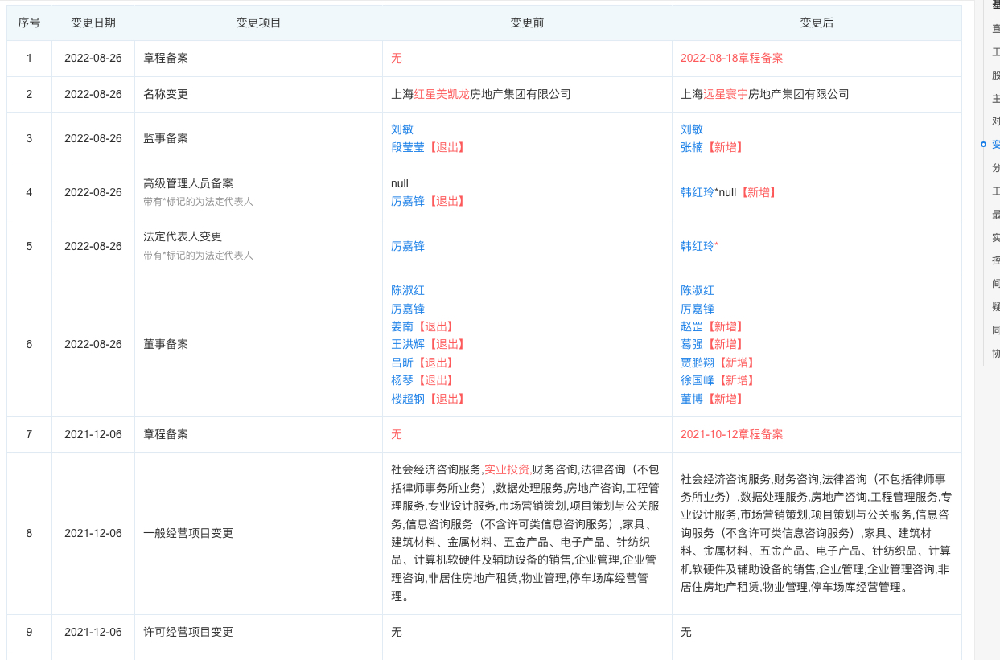

# 房子

## 预备知识

> 各地成立了`规划与自然资源 委员会/厅/局`
>
> `中华人民共和国自然资源部（国土资源、规划）`
>
> `中华人民共和国住房和城乡建设部（建委、房管）`
>
> 地方政府的部门设置相对统一：`上海市规划和国土资源管理局`、`上海市住房和城乡建设管理委员会`、`上海市住房保障和房屋管理局`

- `房地产开发的五证`
  |证书|职能|部门|
  |--|--|--|
  |土地使用权证|国土资源|规划与自然资源|
  |建设用地规划许可证|规划|规划与自然资源|
  |建设工程规划许可证|规划|规划与自然资源|
  |建设工程施工许可证|建设|住房和城乡建设|
  |预售许可证|房管|住房和城乡建设|
  |竣工验收备案证|建委|住房和城乡建设|

  > 每个城市的房地产相关职能包括：国土资源、规划、建委、房管

- `开发商：`开发商就是具有房地产开发资格的企业，一般叫`房地产开发公司`。开发商通过购买土地，规划建设，再把房屋销售给购房者，这个过程就叫做房地产开发
- `投资商：`投资商就是对项目进行考核，认为有投资潜力就进行投资开发，以期回报。
- `住房和城乡建设局：`别名`建设局、住建局`，主管政府审批的工程建设，审计和监督。`XXX住房和城乡建设局`
- `房管局：`全程`土地使用房屋登记局`，已合并到`住房和城乡建设局`
- `城管局：`

## 远洋红星-临港天铂

> 远洋红星·临港天铂（备案名：红星铂雅华庭）项目可售住宅建筑面积约为 9.02 万 ㎡，另外项目自带爱琴海购物公园，海上源文化广场两大商业。其中住宅部分采用一期开发，两期销售的模式开发建设
>
> [参考资料](https://mp.weixin.qq.com/s?__biz=MjM5MTQ5OTk3Mg==&mid=2660238313&idx=4&sn=f1f78e6c9b3f11a147775e964a582a3c&chksm=bdd030428aa7b95479b0192d13941b359fc381a427996d887b18c5a9998e48cdf76c362e1582&scene=27)

- `备案名：`红星铂雅华庭
- `地址：`浦东临港新城夏栎路 518 弄、588 弄
- `预售许可证：`自贸临管房管（2021）预字 0000402 号、0000403 号、0000234 号、0000235 号，2021 年 12 月 29 日 9 点开始认购，2022 年 1 月 20 号进行公证摇号
- `开发商：`上海远星寰宇地产集团有限公司(上海红星美凯龙房地产集团有限公司)
- `投资商：`上海远星寰宇地产集团有限公司(上海红星美凯龙房地产集团有限公司)
- `开发公司/物业公司：`上海洛景企业管理有限公司
- `环线配置：`外郊环
- `项目地址：`上海市浦东新区临港大道与麦冬路交汇处
- `售楼处地址：`上海市浦东新区夏栎路 666 弄 8 号（远洋红星·临港天铂销售中心）

### 上海红星美凯龙房地产集团有限公司

> 2022 年 8 月 26 日，名称变更，由上海红星美凯龙房地产集团有限公司，变更为上海远星寰宇地产集团有限公司
> 
>
> 董事变更

- `陈淑红：重庆红星美凯龙企业发展有限公司`的董事
- `厉嘉锋：重庆红星美凯龙企业发展有限公司`的董事兼总经理
- `赵罡：重庆红星美凯龙企业发展有限公司`的董事
- `葛强：重庆红星美凯龙企业发展有限公司`的董事
- `贾鹏翔：重庆红星美凯龙企业发展有限公司`的董事长
- `徐国峰：重庆红星美凯龙企业发展有限公司`的副董事长
- `董博：上海远星寰宇地产集团有限公司`的懂事

> 退出人员

- `姜南：`
- `王洪辉：远洋集团`的执行懂事、执行总裁
- `吕昕：`
- `杨琴：`远洋控股集团？？？
- `楼超钢：`上海爱琴海商业集团股份有限公司？？？

> 监事变更

- `刘敏：重庆红星美凯龙企业发展有限公司`的监事
- `张楠：重庆红星美凯龙企业发展有限公司`的监事

### 上海远星寰宇地产集团有限公司

- `成立时间：`2008-08-29
- `统一社会信用代码/纳税人识别号：`913100006793419862
- `电话：`021-68880777
- `曾用名：`上海红星美凯龙房地产集团有限公司、上海红星美凯龙房地产有限公司
- `法定代表人：`韩红玲

- `董事长：`贾鹏翔
- `副董事长：`徐国峰
- `总经理：`韩红玲------
- `监事：`张楠
- `懂事：`董博------
- `懂事：`陈淑红
- `监事：`刘敏
- `懂事：`厉嘉锋
- `懂事：`葛强
- `懂事：`赵罡

### 上海远序企业管理有限公司

> 是`上海远星寰宇地产集团有限公司`的大股东，占股 97%+

- `董事长：`贾鹏翔
- `副董事长：`徐国峰
- `懂事兼总经理：`厉嘉锋
- `懂事：`陈淑红
- `懂事：`姜南------
- `懂事：`葛强
- `懂事：`赵罡
- `监事：`张楠
- `监事：`刘敏

### 重庆红星美凯龙企业发展有限公司

> 是 `上海远序企业管理有限公司`的唯一股东

- `董事长：`贾鹏翔
- `副董事长：`徐国峰
- `懂事兼总经理：`厉嘉锋
- `懂事：`陈淑红
- `懂事：`姜南------
- `懂事：`葛强
- `懂事：`赵罡
- `监事：`张楠
- `监事：`刘敏

### 上海洛景企业管理有限公司

## 远洋和红星

> 2021 年 7 月 18 日，远洋集团控股有限公司发布公告，远洋集团、远洋资本与红星控股正式签署协议，以 40 亿元获取红星地产 70%股权。三方将有效持有重庆红星美凯龙企业发展有限公司 35%、35%、30%的股权，共同推进红星地产的后续开发与经营。

- `远洋集团控股有限公司`
- `远洋资本`
- `红星控股`

## 参考资料

[楼盘参数](https://mfang.58.com/cn/loupan/59080945/params/)

[上海市住房和城乡建设管理委员会](https://zjw.sh.gov.cn/?ivk_sa=1024320u)

[远洋与红星](https://baijiahao.baidu.com/s?id=1705622355789048742&wfr=spider&for=pc)
