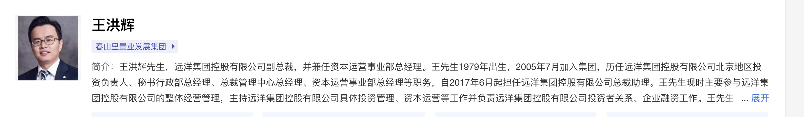
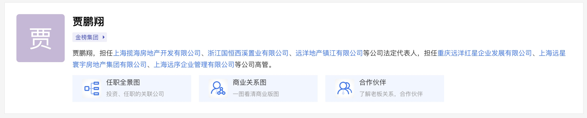
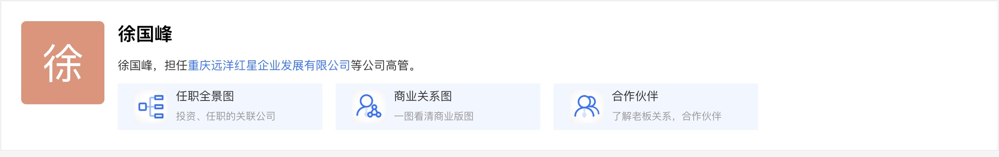
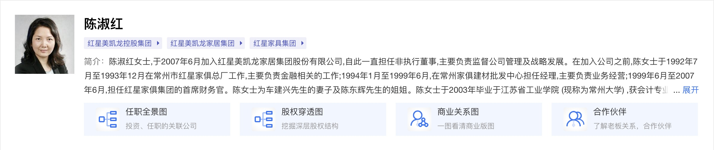
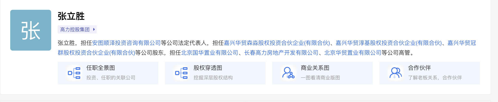
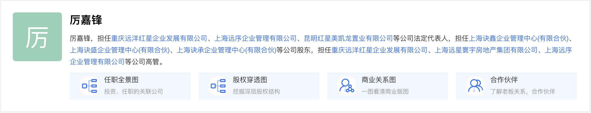
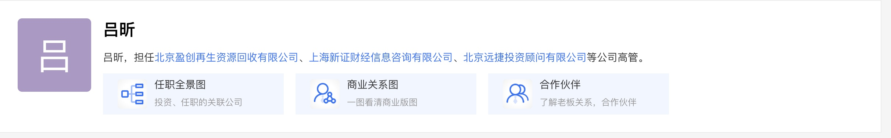
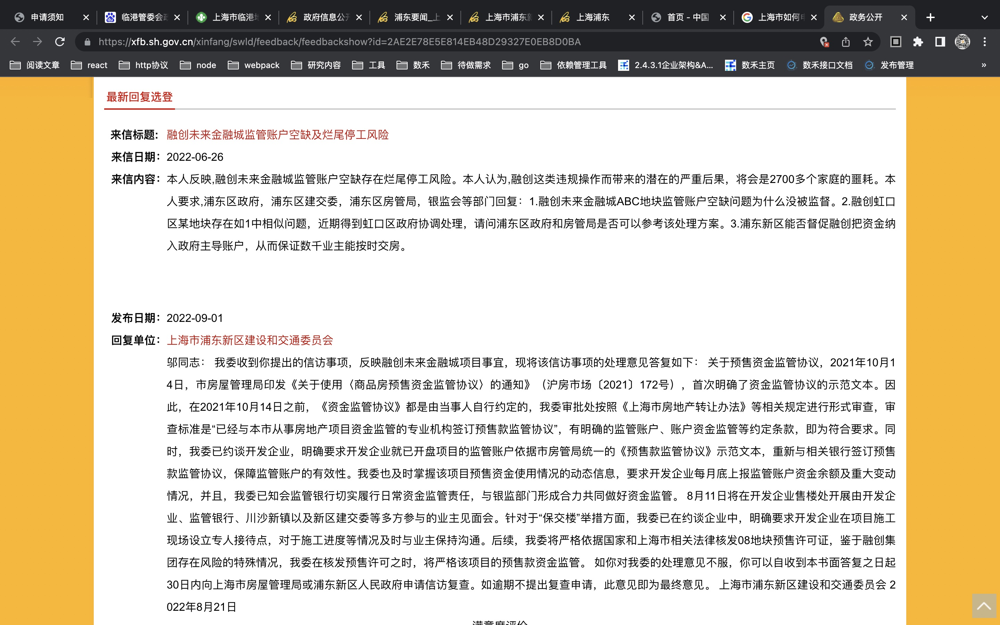

# 房子

## 预备知识

> 各地成立了`规划与自然资源 委员会/厅/局`
>
> `中华人民共和国自然资源部（国土资源、规划）`
>
> `中华人民共和国住房和城乡建设部（建委、房管）`
>
> 地方政府的部门设置相对统一：`上海市规划和国土资源管理局`、`上海市住房和城乡建设管理委员会`、`上海市住房保障和房屋管理局`

- `房地产开发的五证`
  |证书|职能|部门|
  |--|--|--|
  |土地使用权证|国土资源|规划与自然资源|
  |建设用地规划许可证|规划|规划与自然资源|
  |建设工程规划许可证|规划|规划与自然资源|
  |建设工程施工许可证|建设|住房和城乡建设|
  |预售许可证|房管|住房和城乡建设|
  |竣工验收备案证|建委|住房和城乡建设|

  > 每个城市的房地产相关职能包括：国土资源、规划、建委、房管

- `开发商：`开发商就是具有房地产开发资格的企业，一般叫`房地产开发公司`。开发商通过购买土地，规划建设，再把房屋销售给购房者，这个过程就叫做房地产开发
- `投资商：`投资商就是对项目进行考核，认为有投资潜力就进行投资开发，以期回报。
- `住房和城乡建设局：`别名`建设局、住建局`，主管政府审批的工程建设，审计和监督。`XXX住房和城乡建设局`
- `房管局：`全程`土地使用房屋登记局`，已合并到`住房和城乡建设局`
- `城管局：`
- `商品房预售许可证：`

## 高管分布分析

### 远洋系

### 红星系

### 不确定

## 远洋红星-临港天铂

> 远洋红星·临港天铂（备案名：红星铂雅华庭）项目可售住宅建筑面积约为 9.02 万 ㎡，另外项目自带爱琴海购物公园，海上源文化广场两大商业。其中住宅部分采用一期开发，两期销售的模式开发建设
>
> [参考资料](https://mp.weixin.qq.com/s?__biz=MjM5MTQ5OTk3Mg==&mid=2660238313&idx=4&sn=f1f78e6c9b3f11a147775e964a582a3c&chksm=bdd030428aa7b95479b0192d13941b359fc381a427996d887b18c5a9998e48cdf76c362e1582&scene=27)

- `备案名：`红星铂雅华庭
- `地址：`浦东临港新城夏栎路 518 弄、588 弄
- `预售许可证：`自贸临管房管（2021）预字 0000402 号、0000403 号、0000234 号、0000235 号，2021 年 12 月 29 日 9 点开始认购，2022 年 1 月 20 号进行公证摇号
- `开发商：`上海远星寰宇地产集团有限公司(上海红星美凯龙房地产集团有限公司)
- `投资商：`上海远星寰宇地产集团有限公司(上海红星美凯龙房地产集团有限公司)
- `开发公司/物业公司：`上海洛景企业管理有限公司
- `环线配置：`外郊环
- `项目地址：`上海市浦东新区临港大道与麦冬路交汇处
- `售楼处地址：`上海市浦东新区夏栎路 666 弄 8 号（远洋红星·临港天铂销售中心）
- `监管机构：`南汇区房屋土地管理局
- `预售款监管机构：`恒丰银行股份有限公司上海分行
- `预售款监管账号账户名：`上海洛景企业管理有限公司
- `预售款监管账号：`31050101100100000011
- `承建单位：`四川博诚建筑工程有限公司

## 恒丰银行股份有限公司上海分行

> 尝试咨询监管银行查询对应监管账号所需材料

- `工商登记电话：`021-20576688，
- `查询预售资金监管账号名称：`上海洛景企业管理有限公司
- `查询预售资金监管账号`：31050101100100000011
- `工商登记地址：`中国（上海）自由贸易试验区张杨路 1353 号 1 层、源深路 419 号 2、3、5、6、7、8 层
- `统一社会应用代码：`91310000MA1K34EM3Q
- `登记机关：`自由贸易试验区市场监督管理局

### 上海红星美凯龙房地产集团有限公司

> 2022 年 8 月 26 日，名称变更，由上海红星美凯龙房地产集团有限公司，变更为上海远星寰宇地产集团有限公司
> 
>
> 董事变更

- `陈淑红：重庆红星美凯龙企业发展有限公司`的董事
- `厉嘉锋：重庆红星美凯龙企业发展有限公司`的董事兼总经理
- `赵罡：重庆红星美凯龙企业发展有限公司`的董事
- `葛强：重庆红星美凯龙企业发展有限公司`的董事
- `贾鹏翔：重庆红星美凯龙企业发展有限公司`的董事长
- `徐国峰：重庆红星美凯龙企业发展有限公司`的副董事长
- `董博：上海远星寰宇地产集团有限公司`的懂事

> 退出人员

- `姜南：`
- `王洪辉：远洋集团`的执行懂事、执行总裁
- `吕昕：`
- `杨琴：`远洋控股集团？？？
- `楼超钢：`上海爱琴海商业集团股份有限公司？？？

> 监事变更

- `刘敏：重庆红星美凯龙企业发展有限公司`的监事
- `张楠：重庆红星美凯龙企业发展有限公司`的监事

### 上海远星寰宇地产集团有限公司

- `成立时间：`2008-08-29
- `统一社会信用代码/纳税人识别号：`913100006793419862
- `电话：`021-68880777
- `曾用名：`上海红星美凯龙房地产集团有限公司、上海红星美凯龙房地产有限公司
- `法定代表人：`韩红玲

- `董事长：`贾鹏翔
- `副董事长：`徐国峰
- `总经理：`韩红玲------
- `监事：`张楠
- `懂事：`董博------
- `懂事：`陈淑红
- `监事：`刘敏
- `懂事：`厉嘉锋
- `懂事：`葛强
- `懂事：`赵罡

### 上海远序企业管理有限公司

> 是`上海远星寰宇地产集团有限公司`的大股东，占股 97%+

- `董事长：`贾鹏翔
- `副董事长：`徐国峰
- `懂事兼总经理：`厉嘉锋
- `懂事：`陈淑红
- `懂事：`姜南------
- `懂事：`葛强
- `懂事：`赵罡
- `监事：`张楠
- `监事：`刘敏

### 重庆远洋红星企业发展有限公司(重庆红星美凯龙企业发展有限公司)

> 是 `上海远序企业管理有限公司`的唯一股东
> `常州远弘置业有限公司`、`重庆远洋红星企业发展有限公司`

- `董事长：`贾鹏翔
- `副董事长：`徐国峰
- `懂事兼总经理：`厉嘉锋
- `懂事：`陈淑红
- `懂事：`姜南------
- `懂事：`葛强
- `懂事：`赵罡
- `监事：`张楠
- `监事：`刘敏

### 上海洛景企业管理有限公司

> `上海洛景企业管理有限公司`的大股东是`上海洛星企业管理有限公司`，掌握 100%股权
>
> `上海洛星企业管理有限公司`的大股东是`常州洛星企业管理有限公司`，掌握 100%股权
>
> `常州洛星企业管理有限公司`的大股东是`常州远弘置业有限公司`，掌握 100%股权
>
> `常州远弘置业有限公司`的大股东是`重庆红星美凯龙企业发展有限公司`，掌握 100%股权
>
> `重庆远洋红星企业发展有限公司(重庆红星美凯龙企业发展有限公司)`的大股东是``，掌握 100%股权
>
> 上海洛景企业管理有限公司、常州洛星企业管理有限公司管理人员都是下面管理人员

- `董事长兼总经理：`韩维清
- `懂事：`董博
- `懂事：`舒维伟
- `监事：`徐恬恬
- `未知：`苏峰
  > 管理人员同重庆红星美凯龙企业发展有限公司

## 远洋和红星

> 2021 年 7 月 18 日，远洋集团控股有限公司发布公告，远洋集团、远洋资本与红星控股正式签署协议，以 40 亿元获取红星地产 70%股权。三方将有效持有重庆红星美凯龙企业发展有限公司 35%、35%、30%的股权，共同推进红星地产的后续开发与经营。

- `远洋集团控股有限公司`
- `远洋资本`
- `红星控股`

## 房屋预售资金监管

> 临港新片区管委会 2021 年 2 月 4 日公布了《临港新片区加强房地产项目预售资金监管指导意见（试行）》，公告表示，临港新片区房地产项目预售资金的监督管理遵循"政府指导，银行监管，专款专用"的原则。对监管银行实行短名单制，对房地产开发企业实行黑名单制，督促监管银行落实资金监管责任，监督房地产开发企业按照资金监管要求配合监管银行做好资金管理
>
> 预售资金优先用于项目建设，在此前提下可以视情况均衡还贷，项目交房后预售资金可申请解除监管

### 如何查询预售资金账户余额

- `通过开发商直接查看：一般行不通`
- `咨询监管银行如何查询：需要提前准备资料`
- `去住建部门等监管部门查询，需要提前准备资料`

## 投诉

> [中央政府网站](http://www.gov.cn)
>
> [上海市浦东新区人民政府](https://www.pudong.gov.cn/)
>
> [上海市浦东新区政府](https://www.pudong.gov.cn)
>
> [中国（上海）自由贸易试验区临港新片区管理委员会](https://www.lingang.gov.cn)
>
> [管委会领导](https://www.lingang.gov.cn/html/website/lgxc/index/government/opendutys/guanweihuilingdao/index.html)
>
> [建设和交通管理处](https://www.lingang.gov.cn/html/website/lgxc/index/government/opendutys/openduty/index.html)
>
> [上海市浦东新区建设和交通委员会政府信息公开指南](https://www.pudong.gov.cn/zwgk_zfxxgkzn_zfbm_jjwfgjmfbrfb_gkzn/20220108/454519.html)

- `政府信息，是指行政机关在履行行政管理职能过程中制作或者获取的，以一定形式记录、保存的信息。`
- `请您按要求准确、完整填写信息，保证表达清楚、语句通顺、意思完整，以便行政机关更好地答复`
- `信访投诉、廉政举报、业务咨询、意见建议等事项不属于依申请公开政府信息范畴`
- `行政机关已就申请人提出的政府信息公开申请作出答复、申请人重复申请公开相同政府信息的，将不予重复处理`
- `如本系统无法满足您的申请需求，请通过书面等其他方式提出申请，相关程序及要求请见中国银保监会及其派出机构《政府信息公开指南》`

### 投诉渠道

### 申诉监管账号资金公开

- `第一层投诉渠道：临港管委会的`建设和交通管理处和吴杰
  > [临港管委会信箱](https://www.lingang.gov.cn/html/website/lgxc/index/indexmsg/)
  >
  > 管委会领导：吴杰，分管`建设和交通管理处`
  >
  > 直接职能部门：中国（上海）自由贸易试验区临港新片区管理委员会下设结构：[建设和交通管理处](https://www.lingang.gov.cn/html/website/lgxc/index/government/opendutys/openduty/index.html)
  >
  > 信息公开申请：
  >
  > 申请地址：https://xxgk.sh.gov.cn/zwgk_interface/pages/zwgkfront/publicApply.html?ouguid=0c1ccf6f-8533-4977-a61a-b208a07563b5
  >
  > 申请内容：
  管委会落实预售资金全过程监管的，涉及红星铂雅华庭楼盘开发商上海洛景企业管理有限公司的月报，
对应楼盘备案名：红星铂雅华庭；
地址：浦东临港新城夏栎路 518 弄、588 弄；
开发商：上海洛景企业管理有限公司；
预售款监管机构：恒丰银行股份有限公司上海分行
预售款监管账号账户名：上海洛景企业管理有限公司
一期预售款监管账号：802110010122200390
二期预售款监管账号：31050101100100000011
- `第二层投诉渠道：浦东区政府`
  > [浦东新区区委信箱](https://qxf.sh.gov.cn/310115/party.getAreaPartyList.do)
  >
  > [上海市浦东新区建设和交通委员会](https://www.pudong.gov.cn/jjw/)
- `第三层投诉渠道：上海市政府`
  > [上海市领导信箱](https://www.shanghai.gov.cn/nw48867/index.html)
  >
  > [上海市住房和城乡建设管理委员会](https://www.shanghai.gov.cn/nw2405/20201030/0a9703842737468ca013e5e18d1246fb.html)
- `第四层投诉渠道：国务院`

  > [我向总理说句话](http://www.gov.cn/hudong/xzlwh.htm)
  >
  > [我要 留言](http://www.gov.cn/hudong/index.htm)
  >
  > [中华人民共和国住房和城乡建设部](http://www.gov.cn/guowuyuan/zuzhi.htm)

- `银保监会申诉`监管银行向购房者公开监管账号余额
  > [中国银行保险监督管理委员会](http://ysqpt.cbirc.gov.cn/requestSpecPage.html)

### 其它非职能部门投诉渠道

- `12306：`电话或者小程序
- `国务院微信小程序：`

### 投诉及申诉内容

- 申请`建设和交通管理处`对远洋红星-临港天铂楼盘开发商上海洛景企业管理有限公司房屋预售资金的监管信息公开，同时向全体业主公开房屋预售资金监管账户的余额，并形成定期向全体购房者公开监管账号的有效机制
- 投诉`上海洛景企业管理有限公司`，私自停工且多次欺骗业主复工的恶劣行为，督促建设和交通管理处行使监管职责，同时由临港管委会牵头成立专门的工作小组，拉建设和交通管理处、上海洛景企业管理有限公司、业主代表一起会谈，正面回答业主的所有疑问和停工原因，同时形成长期有效的监控账户余额及其收支明细定期向全体购房者公开的有效机制

## 参考资料

[楼盘参数](https://mfang.58.com/cn/loupan/59080945/params/)

[上海市住房和城乡建设管理委员会](https://zjw.sh.gov.cn/?ivk_sa=1024320u)

[远洋与红星](https://baijiahao.baidu.com/s?id=1705622355789048742&wfr=spider&for=pc)
