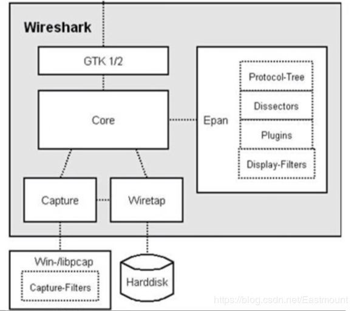

# OSI 网络七层模型

## 数字签名：用于验证数据来源，防止数据被篡改

> 防止伪造，防止篡改，使用私钥签名，使用公钥验签
>
> 加密：用公钥加密明文得到密文进行传输
>
> 解密：用私钥解密密文得到明文
>
> 签名：用私钥对内容加密得到签名
>
> 验签：用公钥解密签名得到内容
>
> 使用私钥对内容加密生成签名，将签名和内容一起发送给接收方；接收方使用公钥验证签名获取内容，和接收到的内容对比，完全一样，说明数据没有被篡改。同时，说明内容来源于发布公钥的所有者，因为没有私钥无法生成一样的签名

## 摘要（指纹 MD5、SHA-1、SHA-256）：更高效的签名和加密

> 使用摘要算法对内容生成摘要，再用私钥对摘要加密生成签名。接受者验签得到摘要，再用摘要将内容计算摘要进行对比
>
> 使用对称密钥加密内容

## 数字签名的问题

> 如果公钥被劫持冒充了，仲么办？所以需要数字证书，证明 XXX 公钥匙 XXX 的

## 数字证书：防止公钥被劫持伪造

> CA 机构的证书默认被系统或相关应用内置且信任，故 CA 结构可以签发其它业务方的数字证书

## openssh：SSH 是自签证书，易遭遇中间人攻击

> OpenSSH 是 SSH（SecureShell）协议的免费开源实现。OpenSSH 提供了服务端后台程序和客户端工具，用来加密远程控件和文件传输过程中的数据，并由此来代替原来的类似服务。SSH 中使用了 MD5、RSA、DES 等密码算法，保证数据的机密性、完整性、不可重放攻击。整个过程中包括密钥协商和交换，以及数据加密传送和解密等等。
>
> 默认端口：22 或 830
>
> SSH 协议有 SSH1.X（SSH2.0 之前的版本）和 SSH2.0 版本。SSH2.0 协议相比 SSH1.X 协议来说，在结构上做了扩展，可以支持更多的认证方法和密钥交换方法，同时提高了服务能力（如 SFTP）
>
> SSH 建立过程<https://www.cnblogs.com/54chensongxia/p/11907039.html>

### SSH 风险点

> 由于 SSH 不像 https 协议那样，SSH 协议的公钥是没有证书中心（CA）公证的，也就是说，都是自己签发的。这就导致如果有人截获了登陆请求，然后冒充远程主机，将伪造的公钥发给用户，那么用户很难辨别真伪，用户再通过伪造的公钥加密密码，再发送给冒充主机，此时冒充的主机就可以获取用户的登陆密码了，那么 SSH 的安全机制就荡然无存了，这也就是我们常说的中间人攻击。

### 解决方案

> SSH 设定了.ssh/known_hosts，远程主机确认连接后，就会将公钥写入 known_hosts 文件

### 服务端开启 SSH

- `生成本地的RSA、DSA或ECC密钥对`

## 物理层和数据链路层

> 数模转换和模数转换
>
> EEE802 标准定义物理网络接口,如网卡、网桥、路由器、连接器、电缆及所有与物理网络连接相关的信令和接入方法

### MAC 协议

### CSMA/CD

## 网络层

### IP

### ARP：地址解析协议

### ARPRIP

### RARP

### ICMP：控制报文协议

### OSPF

### BGP：路由选择协议

### NAT：网络地址转换协议

## 传输层

### TCP（Transmisson Control Protocol）

### UDP（User Datagram Protocol）

## 应用层（会话层、表示层、应用层）

### HTTP：超文本传输协议

### DNS：域名系统

### FTP（File Transfer Protocol）：文件传输协议

### DHCP（Dynamic Host Configuration Protocol）：动态主机配置协议

### SMTP：简单邮件传输协议（发送）

### POP3：邮件接收协议

### IMAP：邮件接收协议

### Telnet：远程登录协议

### SSH（Secure Shell）：安全外壳协议

> SSH 会对传输的数据进行加密；但 Telnet 不会加密传输数据

## Wireshark

> libpcap 和 WinPcap 是 Wireshark 的底层依赖库，提供了通用的抓包接口，能从不同的网络（以太网、令牌环网、ATM 网）接口获取数据包

### libpcap

> libpcap（Packet Capture Library），即数据包捕获函数库，是 Unix/Linux 平台下的网络数据包捕获函数库。它是一个独立于系统的用户层包捕获的 API 接口，为底层网络监测提供了一个可移植的框架。libpcap 主要由两部份组成：网络分接头(Network Tap)和数据过滤器(Packet Filter)。网络分接头从网络设备驱动程序中收集数据拷贝，过滤器决定是否接收该数据包

## privoxy：代理，支持将 sock 协议专程 http 协议
