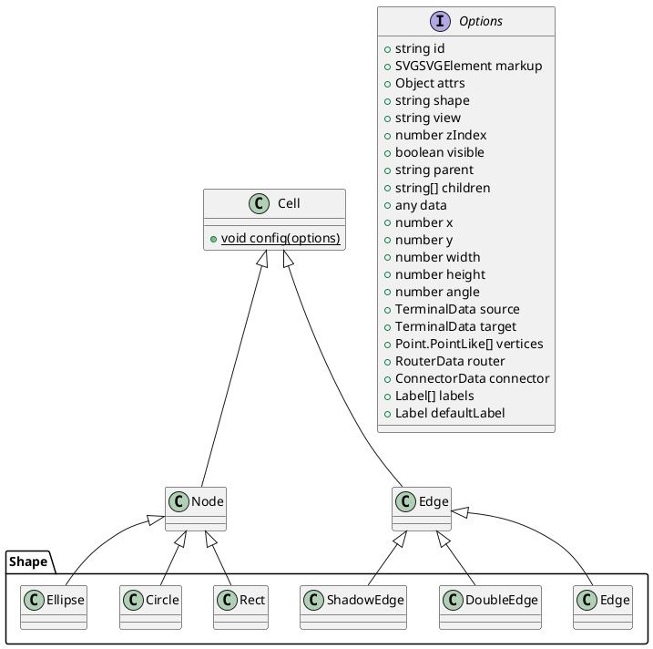

# 图形化工具

## x6: AntV 旗下的图编辑引擎，提供了一系列开箱即用的交互组件和简单易用的节点定制能力

> 方便快速搭建：流程图、DAG 图、ER 图等等
>
> 支持使用 SVG、HTML、React、Vue 定制节点样式和交互

```shell
    npm install @antv/x6
```

## X6 术语

- `Graph：`画布，支持画布相关操作
- `Model：`画布对应的模型
  - `Cell：`数据基类
  - `Node：`节点数据
  - `Edge：`边数据
- `View：`
  - `CellView：`Cell 数据对应的视图
  - `NodeView：`Node 数据对应的视图
  - `EdgeView：`Edge 数据对应的视图
- `Coordinate：`坐标系工具

### 默认，X6 使用 rect 图形渲染

```js
/*
  节点基础属性
  node = {
    id: '唯一识别',
    // 坐标
    x: 40,
    y: 40,
    // 尺寸
    width: 200,
    height: 200,
    shape: '默认是rect',
    label: '显示文案',
    // 其它
    attrs: {},

  }
  edge = {
    source: '起始节点',
    target: '目标节点',
    shape: '默认是单实线箭头, double-edge, shadow-edge',
    attrs: {},
    vertices: '',
    router: '',
    connector: '',
    labels: '',
    defaultLabel: ''
  }
  -------------
  生成元素的方法：
    1、使用对应的构造函数，生成元素实例
    2、使用图对应api直接生成
      graph.addNode()生成节点
      graph.addEdge()生成边
*/
```

### Graph（画布）：图的载体，包含了图上所有元素（节点和边），同时挂载了图的相关操作

- `新建画布:`new Graph(options)
- `画布平移:`options.panning and options.scroller

  ```js
  /*
  配置项:
    panning.enabled
    panning.modifiers
    panning.eventTypes
  Apis:
    graph.isPannable() // 画布是否可以平移
    graph.enablePanning() // 启用画布平移
    graph.disablePanning() // 禁用画布平移
    graph.togglePanning() // 切换画布平移状态
   */
  ```

- `画布缩放:`options.mousewheel

  ```js
  /*
  配置项:
    mousewheel
  Apis:
    graph.zoom()
  */
  ```

- `画布居中：`讲画布内容中心与视口中心对齐

  ```js
  /*
  Apis:
    graph.centerContent()
  */
  ```

- `画布网格 Grid`

> `类型type：[dot, fixedDot, mesh, doubleMesh]`

- `画布背景 Background：` 背景层在 DOM 层级上位于画布的最底层

- `画布剪切板 Clipboard`

- `画布撤销重做 History`
- `销毁画布：`graph.dispose()

### 元素(Cell):提供了节点和边共同的属性和方法

```js
/*
  id
  markup
  attrs
  shape
  view:渲染节点或边的视图
  zIndex
  visible
  parent
  children
  data
*/
```

### 节点元素（Node）

> X6 内置了节点类型，也支持扩展节点类型

#### 内置节点类型

> 比较抽象的节点有 Cell、Node、Edge
>
> 具体用于业务的节点存在于 Shape 命名空间



#### 自定义节点类型

> 自定义节点，实际上是从基础节点派生出我们自己的节点，并覆盖基类的配置和方法

```js
// 自定义节点（可以从Cell、Node、Edge派生，cell提供了shape和markup属性）
// 使用继承的cell.config(options)定义节点类型，并使用graph.registerNode进行注册
// 使用特定类型提供的XXX.define(options)方法定义节点类型，并使用graph.registerNode进行注册
// 使用graph.registerNode()直接定义并注册节点类型
/*
  Graph.registerNode(name: string, cls: typeof Node, overwrite?: boolean)
  Graph.registerNode(name: string, options: Object, overwrite?: boolean)
*/
// 方案一
import { Node } from "antv/x6"
// 继承
class Rect extends Node {
  // 扩展内容，比如操作业务数据的方法
}
// 配置,使用静态方法做默认配置cell.config(options),该方法会被继承
Rect.config({
  width: 100,
  height: 100,
  markup: [
    {
      tagName: 'rect',
      selector: 'body',
    },
    {
      tagName: 'text',
      selector: 'label'
    }
  ],
  attrs: {
    body: {
      fill: '#ffffff',
      stroke: '#333333',
      strokeWidth: 2
    },
    label: {

    }
  },
  propHooks(metadata) {
    cosnt { label, ...others} = metadata
    if (label) {
      ObjectExt.setByPath(others, 'attrs/text/text', label)
    }

    return others
  }
})
// 注册自定义节点类型到x6系统
// Graph.registerNode(name: string, cls: typeof Node, overwrite?: boolean)
Graph.registerNode('rect', 'Rect');// 注册shape为rect的节点类型
graph.addNode({
  shape: 'rect',
  x: 30,
  y: 40
})


```

### 边元素（Edge）

#### vertices（路径点）

> 边从起点开始，按顺序经过路径点，最后到达终点

#### router（修改过的 vertices）

> router 将对 vertices 进一步处理，并在必要时添加额外的点，然后返回处理后的点
>
> 可选值：[normal, orth, oneSide, manhattan, metro, er],可以自定义路由
>
> 路由通过注册方式注册到 x6 系统中

#### connector（将路由返回的点加工成渲染边需要的 pathData）

> 可选值：[normal, rounded, smooth, jumpover],可自定义链接器
>
> 通过注册方式注册到 x6 系统

### Model(Cell, Node, Edge, Group)

> Cell

- `id：唯一标识`
- `markup：渲染使用的HTML或SVG标签`
  - `tagName：HTML或SVG标签名`
  - `ns：标签对应命名空间`
  - `selector：SVG或HTML标签的唯一标识`
  - `groupSelector：群组选择器，为群组内的多个元素应用指定样式`
  - `attrs：键值对，属性key，值是属性value`
  - `style：SVG或HTML的行内样式`
  - `className：SVG或HTML的CSS样式名`
  - `textContent：SVG或HTML元素的文本内容`
- `attrs：同markup中的attrs，键是selctor，值是对应属性（key-value）`
- `shape：节点或边的图形`

  - `rect：Shape.Rect`
  - `circle：Shape.Circle`
  - `ellipse：Shape.Ellipse`
  - `polygon：Shape.Polygon`
  - `polyline：Shape.Polyline`
  - `path：Shape.Path`
  - `image：Shape.Image`
  - `html：Shape.HTML，HTML节点，使用foreignObject渲染`
  - `text-block：Shape.TextBlock`
  - `image-bordered：Shape.bordered`
  - `image-embedded：Shape.EmbeddedImage`
  - `image-inscribed：Shape.InscribedImage`
  - `cylinder：Shape.Cylinder`

  - `edge：Shape.Edge`
  - `double-edge：Shape.DoubleEdge`
  - `shadow-edge：Shape.ShadowEdge`

- `view：指定渲染节点或边使用的视图`
- `zIndex：层级`
- `visible：是否可见`
- `parent：父节点`
- `children：子节点或边`
- `data：附加数据`

> Node：1、使用构造函数 new Shape.Rect(options)构造；2、graph.addNode(options)构造

- `x：x坐标`
- `y：y坐标`
- `width：节点宽度`
- `height：节点高度`
- `angle：节点旋转角度`

> Edge：1、使用构造函数 new Shape.Edge(options)构造；2、graph.addEdge(options)构造

- `spurce：起始节点`
- `target：结束节点`
- `vertices：路径点，连线上的锚点`
- `router：路由，对vertices进一步处理，并添加额外节点。特殊的vertices。都是通过注册方式注册到X6，只需要name和args参数既可以使用。也可以自定义路由`
  - `name: 路由名称，例如orth正交路由。可选值[normal, orth, oneSide, manhattan, metro, er]`
  - `args：对应路由参数`
- `connector：链接器，将路由返回的点加工成渲染需要的pathData`
- `labels：标签`
- `defaultLabel：默认标签`

> 群组 Group：节点 node.addChild(child)

> 链接桩 Port：const node = new Node({ports: {}})

> 自定义节点

- `1、class继承：可以扩展方法和属性`

```js
    import { Node } from "@antv/x6";
    // 继承
    class CustomRect extends Node {
        // 自定义一些方法和属性
    }
    // 配置,支持所有节点选项
    CustomRect.config({
        width: "",
        height: "",
        markup: [],
        attrs: {},
        propHooks(metadata) {
        }
        attrHooks(metadata) {
        }
    })
    //  注册节点,(name, cls, overite),name是注册的节点名既shape；cls节点类；重名覆盖选项
    Graph.registerNode("custom-rect", CustomRect)
```

- `2、静态方法define，快捷方法，不扩展方法和属性`

```js
Rect.define({
  shape: 'red-rect'
});
Graph.registerNode();
```

- `3、Graph.registerNode(name, options, overwrite)`

> 自定义边

- `1、继承`

```js
import { Edge as BaseEdge } from '@antv/x6';
class CustomEdge extends BaseEdge {}
CustomEdge.config({
  markup: [],
  attrs: {}
});
Graph.registerEdge('custom-edge', CustomEdge, false);
```

- `2、静态方法define和注册`
- `3、注册：Graph.registerEdge(name, options, overwrite)`

### View(View, CellView, NodeView, EdgeView)

### Registry

### 拖拽 Dnd：import { Addon } from "@antv/x6

### UI Components

```shell
    npm install @antv/x6-react-components
```

### 渲染

> SVG 中有一个特殊的元素<foreignObject>，在该元素内可以内嵌任何 XHTML 元素，所以可以借助该元素渲染 HTML 元素
>
> XHTML 更严格的 HTML 语法要求<https://www.zhihu.com/question/19783105>

```SVG
  <svg xmlns="https://www.w3.org/2000/svg">
    <foreignObject width="120" height="80">
      <body xmlns="https://www.w3.org/1999/xhtml">
        <p>hello world!</p>
      </body>
    </foreignObject>
  </svg>
```

### 渲染 HTML 节点

> Graph.registerHTMLComponent()将 HTML 元素或返回 HTML 的函数注册到系统中

- `shape: "html"`
- `html: content`

### 渲染 React

> 依赖@antv/x6-react-shape,节点渲染时将自动为 React 组件注入一个名为 'node' 的属性，属性值为当前节点的实例。节点每次重新渲染都将触发 React 组件重新渲染
>
> 经验证，ReactDOM.render()首次执行，引起组件的新建，后续的执行，会引起组件的 rerender，这正好验证了官方说明。x6-react-shape 内部本质是使用 ReactDOM.render 插入 react 组件，每个组件都是一个独立的虚拟 dom 树，信息是隔断的

- `shape: "react-shape"`
- `component: <Component />`

## svg

> SVG 文档由<svg>根元素和基本的形状元素构成。另外还有一个 g 元素，它用来把若干个基本形状编成一个组。

### SVG 嵌入到 html 方式

- `直接嵌入html中，content-type：application/xhtml+xml`
- `object标签：<object data="image.svg" type="image/svg+xml />"`
- `iframe标签：<iframe src="image.svg"></iframe>`
- `imge标签：`

### SVG 基本标签

- `rect`
- `circle`
- `ellipse`
- `line`
- `polyline`
- `polygon`
- `path`

### 填充

> 着色方案：使用对象属性，使用内联 CSS 样式，内嵌 CSS 样式，使用外部 CSS 样式

- `fill:`
- `stroke`

### React 组件

> 在 SVG 中有一个特殊的元素 foreignObject，该元素可以内嵌任何 XHTML 元素，所以可以借助该元素渲染 HTML 元素和 React 组件到需要位置

```svg
<svg xmlns="http://www.w3.org/2000/svg">
  <foreignObject width="120" height="50">
    <body xmlns="http://www.w3.org/1999/xhtml">
      <p>Hello World</p>
    </body>
  </foreignObject>
</svg>
```

- `渲染HTML节点：将节点的shape属性指定为html，就可以通过html属性指定需要渲染的HTML元素`

```js
const source = graph.addNode({
  x: 40,
  y: 40,
  width: 100,
  height: 40,
  shape: 'html',
  html() {
    const wrap = document.createElement('div');
    wrap.style.width = '100%';

    return wrap;
  }
});
```

- `渲染React节点：需要依赖独立的包@antv/x6-react-shape`

```js
/*
  系统渲染当前节点时，会自动为React组件注入一个node属性，指向当前节点的实例。
  节点每次渲染，都将触发React组件重新渲染，可以通过node属性和shouldComponentUpdate方法来决定是否重新渲染React组件
*/
import '@antv/x6-react-shape';
import { ReactShape } from '@antv/x6-react-shape';

export class Demo extends React.Component<{ node?: ReactShape, text: string }> {
  shouldComponentUpdate() {
    const { node } = this.props.node;
    if (node) {
      // 仅当节点的 data 发生变化时才触发 MyComponent 组件重新渲染
      if (node.hasChanged('data')) {
        return true;
      }
    }

    return false;
  }

  render() {
    return <div>{this.props.text}</div>;
  }
}

graph.addNode({
  x: 40,
  y: 40,
  width: 100,
  height: 40,
  shape: 'react-shape',
  component: <Demo text="hello" />
});
```

## typescript

### keyof 索引类型查询操作符

### Partial 高级类型<https://jkchao.github.io/typescript-book-chinese/typings/overview.html#%E8%81%94%E5%90%88%E7%B1%BB%E5%9E%8B>

### Typescript 类型系统

```js
/*
  类型注解：
    语法：:TypeAnnotation
    demo：const name: string = "monkey"
  原始类型：
    string、boolean、number等都可以用作类型注解
  数组：
    语法：const arr: string[] = [] as string
  接口：合并类型声明
    语法：interface People {
      name: string
      age: number
    }
  内联类型：可以使用interface或type alias
    let people: {name: string, age: string};
  特殊类型：
    any：关闭类型检查，兼容所有类型
    undefined：可以被复制给任意变量
    null：可以被复制给任意变量
    void：表示函数没有返回值
    unknown
  泛型：
    function reverse<T>(items: T[]): T[]
  联合类型：使用|作为标记，string | number就是联合类型
  交叉类型：extends,从两个对象中创建一个新对象，新对象拥有着两个对象所有的功能
    function extend<T extends object, U extends object>(first: T, second: T): void
  元组类型(字典)：
    语法：:[string, number]
  类型别名：
    语法：type StrNum = string | number， import type { XXX } from 'XXX'


 */
```
